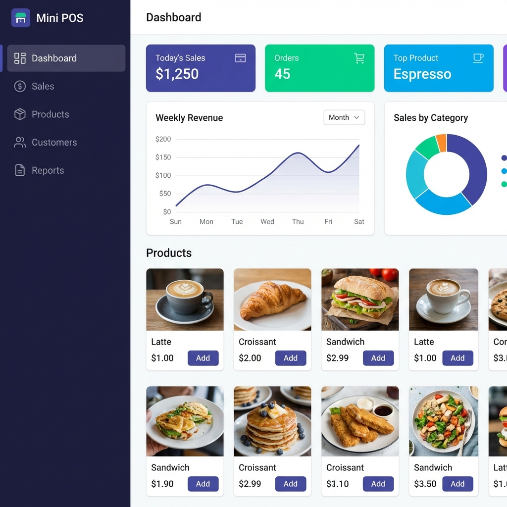

# MINI POS System 🚀



A modern, lightweight, and offline-capable Point of Sale (POS) system built with vanilla JavaScript, Tailwind CSS, and Dexie.js (IndexedDB). Designed for retail and wholesale businesses.

## ✨ Features

*   **🛒 POS Terminal**: Fast and intuitive billing interface with barcode search and product grid.
*   **📦 Inventory Management**: Track stock levels, manage products, and set low-stock alerts.
*   **🔁 Dual Pricing**: Seamlessly switch between Retail and Wholesale pricing models.
*   **🏬 Account Settings**: Customize shop name, address, and contact details for receipts.
*   **🧾 Thermal Receipt Printing**: Generates formatted receipts ready for standard thermal printers (58mm/80mm).
*   **📊 Dashboard & Reports**: Real-time sales statistics, detailed transaction logs, and CSV export.
*   **📂 Local Database**: Powered by Dexie.js, all data is stored securely in your browser. No internet required!

## 🛠 Tech Stack

*   **Frontend**: HTML5, JavaScript (ES6+)
*   **Styling**: Tailwind CSS (CDN based)
*   **Database**: Dexie.js (IndexedDB Wrapper)
*   **Icons**: FontAwesome

## 🚀 Getting Started

1.  Clone the repository:
    ```bash
    git clone https://github.com/SADITH2005/POS-System.git
    ```
2.  Navigate to the project folder.
3.  Open `index.html` in your web browser.
4.  Start selling!

## 📸 Screenshots

> *Add more screenshots here*

## 📜 License

This project is licensed under the MIT License - see the [LICENSE](LICENSE) file for details.

---
*Created with ❤️ by MINI POS Team*
